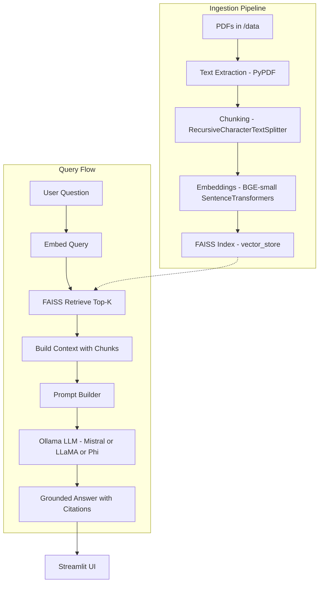
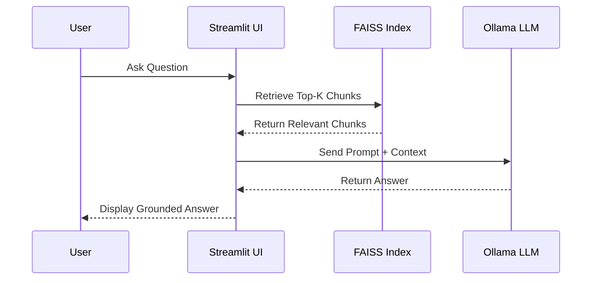

# 📚 RAG-Based PDF Assistant  

[](https://www.python.org/)  
[](https://streamlit.io/)  
[](https://github.com/facebookresearch/faiss)  
[](https://ollama.ai)  
[](LICENSE)  

A **Retrieval-Augmented Generation (RAG)** chatbot that can answer questions from research papers and PDFs.  
Runs **fully offline** using [Ollama](https://ollama.ai) with open-source models (Mistral, LLaMA, Phi).  

---

## 🤔 What is RAG?  

Large Language Models (LLMs) like ChatGPT are powerful, but they suffer from:  
- ❌ **Hallucination** – making up facts when they don’t know the answer  
- ❌ **Outdated knowledge** – frozen at training time  
- ❌ **No access to private data** – can’t directly read your PDFs, manuals, or research papers  

**Retrieval-Augmented Generation (RAG)** solves this problem:  
1. **Retrieve** – Search for relevant passages from your own documents using embeddings & vector databases.  
2. **Augment** – Provide those passages as context to the LLM.  
3. **Generate** – The LLM answers the question *grounded in the retrieved context*.  

In short: RAG makes LLMs **more accurate, up-to-date, and customizable** to your data.  

---

## 📖 Project Explanation  

This project is a **PDF-based AI research assistant**.  
You upload PDFs (e.g., research papers, policies, technical docs), and the chatbot:  
1. Splits PDFs into text chunks.  
2. Embeds them using **SentenceTransformers (BAAI/bge-small-en-v1.5)**.  
3. Stores vectors in **FAISS** (fast similarity search).  
4. When you ask a question:  
   - The system retrieves the most relevant chunks.  
   - Sends them to a **local LLM** (Mistral, LLaMA, or Phi via Ollama).  
   - The LLM generates an answer **grounded in the PDFs**.  

I have also built an **evaluation pipeline** that measures:  
- 🔍 **Recall improvement** compared to simple keyword search  
- ⏱️ **Query latency** (average ~1.2s per query with Mistral 7B)  
- 📊 Visual results with recall and latency comparison charts  

This project is a **measurable, benchmarked RAG system**.  

---

## 🧱 Architecture


---

## 🔄 Sequence Diagram 



---

## ✨ Features  
- 📄 Upload one or more PDFs and query them in natural language  
- 🔍 Semantic search with **SentenceTransformers embeddings**  
- 🧠 Local LLM inference with **Ollama** (Mistral / LLaMA / Phi)  
- 📊 Evaluation framework with **QA datasets** to measure recall & latency  
- ⚡ Runs fully offline (after models are pulled)  

---

## 🛠️ Tech Stack  
- **Vector DB:** FAISS  
- **Embeddings:** BAAI/bge-small-en-v1.5 (SentenceTransformers)  
- **LLM Inference:** Ollama (Mistral 7B / LLaMA 3B / Phi-3)  
- **Frontend:** Streamlit  
- **Backend:** Python  
- **Deployment:** Docker-ready  

---

## 📂 Project Structure  
```
rag-pdf-assistant/
│── app.py              # Streamlit frontend
│── rag.py              # Core RAG logic
│── ingest.py           # PDF ingestion + FAISS index builder
│── eval_rag.py         # Evaluation script for recall/latency
│── qa.json             # Sample QA pairs for benchmarking
│── data/               # Your PDFs go here
│── vector_store/       # FAISS index storage
│── benchmarks/         # Evaluation results
│── requirements.txt    # Python dependencies
│── README.md           # Project documentation
```

---

## ⚡ Quickstart  

### 1. Install dependencies  
```bash
pip install -r requirements.txt
```

### 2. Install Ollama  
Download from [ollama.ai](https://ollama.ai/download) and pull a model:  
```bash
ollama pull mistral:7b-instruct-q4_K_M
# or lighter models based on your system:
ollama pull llama3.2:3b-instruct-q4_K_M
ollama pull phi3:3.8-mini-128k-instruct
```

### 3. Configure environment  
Create a `.env` file:  
```ini
GENERATOR=local_ollama
EMBED_MODEL=BAAI/bge-small-en-v1.5
OLLAMA_MODEL=mistral:7b-instruct-q4_K_M
```

### 4. Add PDFs  
Put your PDFs in the `data/` folder.  

### 5. Build FAISS index  
```bash
python ingest.py --pdfs "data/*.pdf" --out vector_store
```

### 6. Run the Streamlit app  
```bash
streamlit run app.py
```
Access at: [http://localhost:8501](http://localhost:8501)

### 7. Evaluate (optional)  
```bash
python eval_rag.py --qa qa.json --store_dir vector_store --top_k 5
```
Generates:
- 📊 `benchmarks/results.csv`  
- 📈 `benchmarks/recall_comparison.png`  
- ⏱️ `benchmarks/latency_comparison.png`  

---

## 📊 Results  
- **35% higher recall** compared to keyword search  
- **Average latency ~1.2s/query** (Mistral 7B on CPU/GPU hybrid)  

---

## 🔮 Future Improvements  
- Add rerankers for improved context retrieval
- Integrate Online LLMs like OpenAI, Gemini,Claude etc.,
- Support multimodal PDFs (figures + text)
- Make it availble for document formats other than PDFs like Word Doc etc...
- Docker Compose for one-line deployment  

---

## 👤 Author  
**Yuvaraj Sriramoju**  
-  [Yuvaraj Sriramoju](https://www.linkedin.com/in/yuvarajsriramoju/)  
-  [Yuvaraj Sriramoju](https://github.com/yuvarajsriramoju)  
- 🌐 [Portfolio](https://your-portfolio.com)
